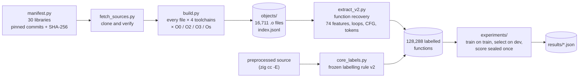
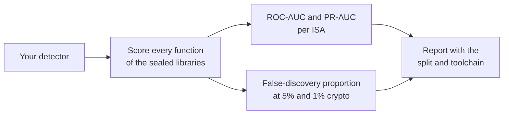
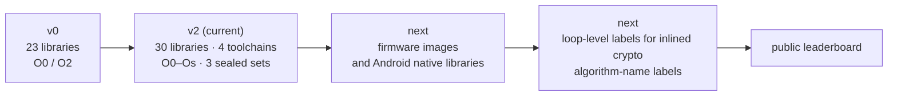

# IndiCrypt-Bench

Part of Paper To Anything (https://papertoanything.com) — research software developed and maintained by Dhruva P Gowda. In development.

**An open, reproducible benchmark for finding cryptography inside compiled binaries, across chip families, with
library-disjoint sealed test sets.**

IndiCrypt-Bench asks one question: *given a stripped binary, which of its functions are cryptographic?* It is the
benchmark behind [V.E.R.A.](https://github.com/dhruva137/V.E.R.A), a certified crypto-discovery engine. Any tool that claims to find crypto in binaries can be tested on it
with the same libraries, the same labels and the same scores.

| | |
|---|---|
| Libraries | **30** open-source libraries at pinned commits: 15 cryptographic, 15 non-cryptographic hard negatives |
| Toolchains | **4**: clang x86-64, gcc x86-64 (MinGW), clang AArch64, clang ARM32 |
| Optimisation levels | O0, O2, O3, Os |
| Compiled objects | **16,711** |
| Labelled functions | **128,288** (after dropping tiny, glue and byte-identical functions, all counted) |
| Sealed test sets | 3 (sealed, sealed-B, sealed-C), **8 sealed crypto libraries**, each registered before training and scored once |
| Labels | from **source**, by a frozen rule, never from the binary |

Numbers come from [`indicrypt_bench/extract_v2_all_report.json`](indicrypt_bench/extract_v2_all_report.json).

## Install

Not on PyPI yet; a PyPI release is planned and the licence is to be announced. For now, install from the repository:

```bash
pip install "indicrypt-bench @ git+https://github.com/dhruva137/indicrypt-bench.git"
indicrypt-bench info                 # manifest, splits, pinned commits (--libraries)
```

The wheel is small: the manifest, the splits, the source-derived label table and the scorer. Compiled objects and
the function table are not shipped; `indicrypt-bench fetch` downloads the released data artifacts, or, while no
release artifact exists, rebuilds them from the pinned sources with the scripts in this repository (see below).

## Quick start: score your detector

Write one row per function with your detector's score (higher = more cryptographic):

```csv
library,rel,name,arch,score
bearssl,src/hash/sha2small.c,br_sha2small_round,x86-64,0.97
brotli,c/enc/hash.c,BrotliHashSomething,aarch64,0.12
```

```bash
indicrypt-bench score predictions.csv --split sealed-all
```

`library`, `rel` and `name` are the keys in `core_labels.csv`; `arch` is `x86-64`, `aarch64` or `arm32`. Labels are
derived from the frozen rule, or pass your own `label` column (`1`/`0`). The report gives ROC-AUC and PR-AUC overall
and per ISA, and the false-discovery proportion among flagged functions at natural, 5% and 1% crypto share, for a
fixed 0.9 cut-off and for conformal Benjamini-Hochberg selection (`--alpha`, default 0.1). Python API:
`from indicrypt_bench.score import score`.

```bash
indicrypt-bench fetch --dest indicrypt-data               # released artifacts if present, else rebuild
indicrypt-bench fetch --rebuild --until sources           # only clone the 30 libraries at their pinned commits
```


---

## Why this benchmark exists

Crypto detectors are usually scored on balanced sets, where half the functions are cryptographic. Real binaries
are not like that: crypto is a small minority of the code. Under those conditions a detector with a fixed
confidence threshold looks excellent in the lab and is mostly wrong in the field. On the sealed libraries of this
benchmark, a fixed 0.9 threshold reports:

| Crypto share of functions | False findings, fixed 0.9 cut-off | False findings, conformal selection (α = 0.1) |
|---|---|---|
| natural (34%) | 14.5% | 6.7% |
| 5% | **60.8%** | **8.0%** |
| 1% | **89.5%** | **3.7%** |

Source: [`results/v1_1_detector.json`](results/v1_1_detector.json). IndiCrypt-Bench therefore reports the
false-discovery proportion at realistic prevalence, not only ROC-AUC.

---

## How it is built



### Splits

Libraries never cross splits, so a score on a sealed set measures generalisation to code the detector has never
seen.

```mermaid
flowchart LR
    subgraph TRAIN["Train"]
        direction TB
        t1["crypto<br/>mbedTLS · libtomcrypt<br/>bcon · tiny-AES"]
        t2["hard negatives<br/>Lua · zstd · cJSON · zlib"]
    end
    subgraph DEV["Dev · selection only"]
        direction TB
        d1["crypto<br/>PQClean · Monocypher<br/>micro-ecc"]
        d2["hard negatives<br/>stb · lz4 · xxHash · kissfft"]
    end
    subgraph SEALED["Sealed · scored once"]
        direction TB
        s1["crypto<br/>BearSSL · TweetNaCl<br/>SipHash"]
        s2["hard negatives<br/>brotli · libdeflate<br/>yyjson · lodepng"]
    end
    subgraph SB["Sealed-B"]
        direction TB
        b1["crypto<br/>libsodium · wolfSSL"]
        b2["hard negatives<br/>SQLite · libpng"]
    end
    subgraph SC["Sealed-C"]
        direction TB
        c1["crypto<br/>BLAKE3 · Argon2<br/>tiny_sha3"]
    end
    TRAIN ==> DEV ==> SEALED ==> SB ==> SC
```



PQClean in dev covers ML-KEM, ML-DSA, HQC, Falcon and SPHINCS+. Sealed-B was registered before the v2 work and
sealed-C during the self-audit, both before any scoring.

miniz is kept in the pool as an additional compression negative.

### Labelling rule (frozen)

A function is **crypto** if its source file implements a primitive **and** its preprocessed body, counting the
static functions it calls (which the compiler inlines), performs at least 3 arithmetic or bitwise operations,
ignoring loop headers and array indices. Thin wrappers in crypto files are excluded rather than labelled negative.
Functions in non-crypto files are negative whatever they contain: an arithmetic-heavy compressor is exactly the
hard negative a detector must learn to reject. The rule reads **source only**, so labels cannot leak detector
features. Full rationale: [`indicrypt_bench/core_labels.py`](indicrypt_bench/core_labels.py).

---

## Build the benchmark from source

Requirements: Python 3.11+, git, and the packages in `requirements.txt` (`ziglang` provides clang for all three
ISAs; MinGW-w64 gcc is needed only for the gcc x86-64 toolchain).

```bash
pip install -r requirements.txt
cd indicrypt_bench
python fetch_sources.py        # clone all 30 libraries at their pinned commits and verify them
python build.py                # compile: every file × toolchain × optimisation level (index.jsonl keeps failures visible)
python extract_v2.py --jobs 6  # per-function features, loops, CFG, data-flow and tokens (v2 shards)
python extract.py              # the v0 function table used by the reference detector (functions.csv.gz)
python core_labels.py          # source-derived function labels (core_labels.csv)
python findcrypt_baseline.py   # the Findcrypt3 signature baseline
cd ../experiments
python v1_1_detector.py        # reference detector + the conformal false-discovery table
```

`build.py --only clang-x64 --opts O2` builds a single slice for a quick check.

---

## Evaluate your own detector



1. Train only on the **train** libraries and choose settings only on **dev**.
2. Score the **sealed** libraries once, per ISA (x86-64, AArch64, ARM32).
3. Report ROC-AUC, PR-AUC, and the false-discovery proportion among flagged functions when crypto is 5% and 1%
   of the functions (subsample positives on the test side only, as `experiments/v1_1_detector.py` does).
4. Say which toolchains and optimisation levels you used.

The reference detector (`experiments/v1_1_detector.py`) shows the whole protocol end to end, including 200 random
calibration/test splits and conformal Benjamini-Hochberg selection.

### Reference results (sealed set)

| | ROC-AUC | PR-AUC |
|---|---|---|
| all ISAs | 0.826 | 0.737 |
| x86-64 | 0.834 | 0.752 |
| AArch64 | 0.805 | 0.722 |
| ARM32 | 0.831 | 0.721 |

Gradient-boosted trees over 74 architecture-neutral mnemonic and operand features, trained on the train split only.
Operand features raise dev ROC-AUC from 0.760 (mnemonics only) to 0.793.

---

## Repository layout

```
indicrypt_bench/   manifest (pinned sources), splits, label table, scorer and CLI (the installed package);
                   fetch, build, extraction, labelling and Findcrypt3 scripts (repository only)
engine/binary_ml/  function recovery, the 74 features, graph views and conformal selection (shared with V.E.R.A.)
experiments/       reference detector and the conformal false-discovery study
results/           reference results
```

Sources and compiled objects are generated locally (`src/`, `objects/`) and are not redistributed: every library
keeps its own licence and is fetched from its upstream at the pinned commit.

---

## Roadmap



---

## Citation

If you use IndiCrypt-Bench, please cite the repository:

```
Dhruva P Gowda. IndiCrypt-Bench: a library-disjoint, cross-architecture benchmark for crypto detection in
stripped binaries. 2026. https://github.com/dhruva137/indicrypt-bench
```

## Related

- [V.E.R.A.](https://github.com/dhruva137/V.E.R.A): the crypto-discovery engine that uses this benchmark.
- Findcrypt3 rules: [polymorf/findcrypt-yara](https://github.com/polymorf/findcrypt-yara).
- Mnemocrypt, NDSS BAR 2025; Where's Crypto?, USENIX Security 2021; Bates et al., *Testing for outliers with
  conformal p-values*, Annals of Statistics 2023.

## Licence

Licence to be announced.

---

## Origin

IndiCrypt-Bench was built to support V.E.R.A. and is maintained alongside it as an independent research project.
